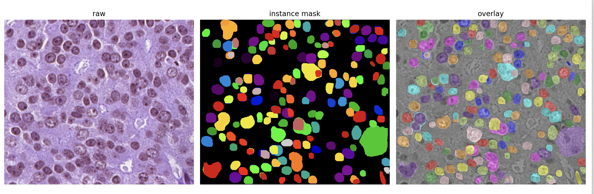
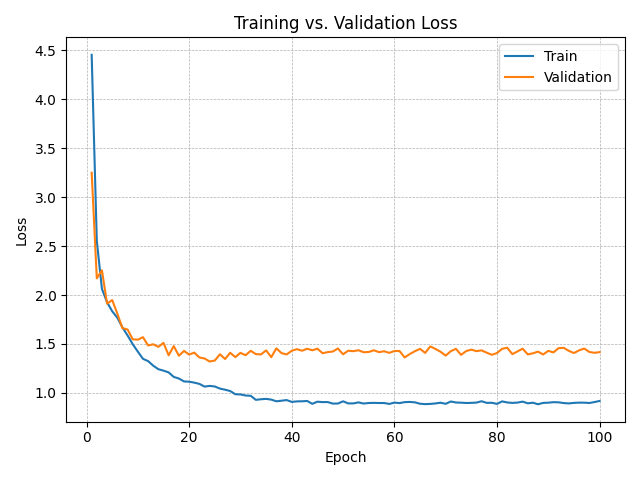

# Instance-Segmentation
Visual Recognitionusing Deep Learning HW3
> Student ID: 313551062  
> Name: 李旻融

## Project Overview
This repository provides an end-to-end pipeline for instance segmentation of microscopic cell images using a customized Mask R-CNN model. The task involves identifying and segmenting individual cell instances of four types in medical images.

## Repository Structure
```Instance-Segmentation/
├── src/
│   ├── dataset.py           # Custom dataset class
│   ├── main.py              # Entry point for training & inference
│   ├── model.py             # Mask R-CNN architecture
│   ├── test.py              # Inference and JSON generation
│   ├── train.py             # Training & validation loop
│   ├── transforms.py        # Augmentation & preprocessing
│   ├── utils.py             # Seed control, RLE encoding
│   └── visualization.py     # Visualize instance prediction overlays
├── requirements.txt         # Required Python packages
├── README.md                # Project documentation
└── .pre-commit-config.yaml  # Optional pre-commit hooks
```

## Implementation

### Model Architecture
- Base: `torchvision.models.detection.MaskRCNN`
- Backbone: ResNet-101 with FPN, pretrained on ImageNet
- Modifications:
  - Custom `EnhancedMaskPredictor` with 4 convolutional layers
  - Fine-tuned anchor generator
  - Increased `box_detections_per_img`, `rpn_post_nms_top_n_train/test`

### Data Preprocessing & Augmentation
- Convert grayscale or 4-channel (RGBA) images to 3-channel RGB
- Augmentations include:
  - Random color jitter
  - Gaussian noise & blur
  - Intensity adjustments to simulate staining variation
  - Histogram equalization

## Configuration options
| Argument         | Type    | Default                       | Description                                             |
| ---------------- | ------- | ----------------------------- | ------------------------------------------------------- |
| `--data_root`    | `Path`  | **(required)**                | Root directory containing `train/` and `test/` folders  |
| `--epochs`       | `int`   | `30`                          | Number of training epochs                               |
| `--lr`           | `float` | `0.0005`                      | Learning rate for optimizer                             |
| `--batch_size`   | `int`   | `2`                           | Mini-batch size during training                         |
| `--output_dir`   | `Path`  | `./checkpoints`               | Directory to save model checkpoints                     |
| `--weights`      | `Path`  | `None`                        | Path to `.pth` file to resume training or for inference |
| `--predict_only` | `flag`  | `False`                       | If set, skips training and runs inference               |
| `--outfile`      | `str`   | `test-results.json`           | Output path for COCO-style predictions                  |
| `--id_map_json`  | `Path`  | `test_image_name_to_ids.json` | Path to the mapping JSON for test image IDs             |


## Getting Started

#### 1. Install dependencies
```
pip install -r requirements.txt
```

#### 2. Prepare Dataset
Ensure the following structure:

```
data/
├── train/
│   ├── <id>/
│   │   ├── image.tif
│   │   ├── class1.tif
│   │   ├── ...
├── test/
│   ├── <id>.tif
├── test_image_name_to_ids.json
```

#### 3. Train the model
```
python -m src.main --data_root data
```

#### 4. Run Inference
```
python -m src.main --data_root data --weights checkpoints/model_best.pth --predict_only
```

## Results
#### Output format
COCO-compatible JSON with RLE masks

#### Visualizations can be rendered with:
```
python -m src.visualization --preds test-results.json --id <image_id> --image /path/to/image.tif
```


####  Loss plots are automatically saved to `loss_curve.png` at the end of training


#### Snapshot of the leaderboard

